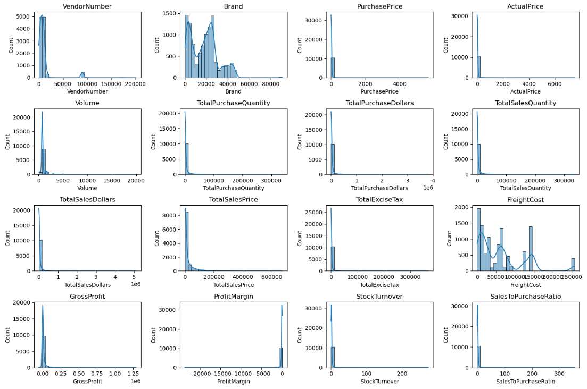
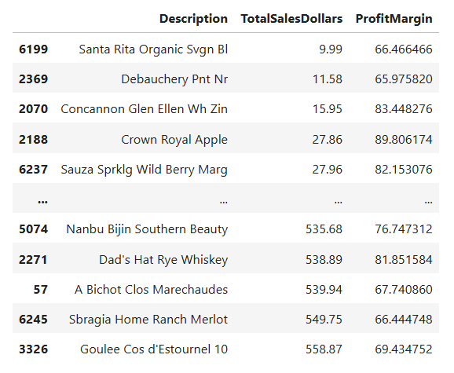
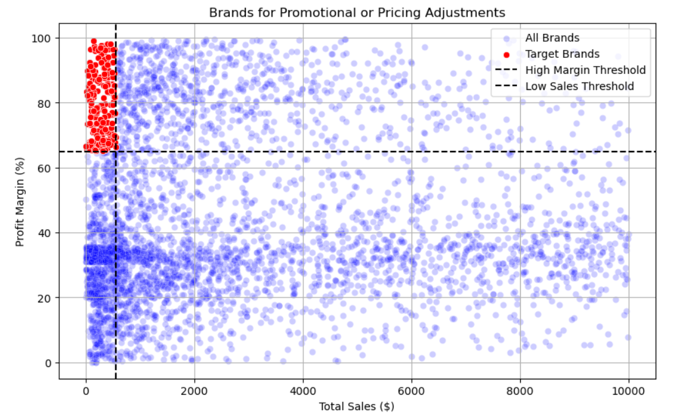
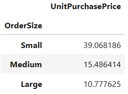
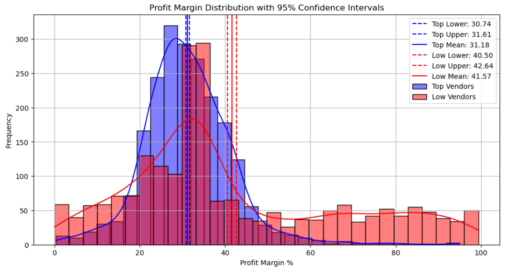

Project Overview

This project focuses on analyzing vendor performance and sales data for an inventory system. It covers the full data workflow from raw data ingestion to analysis and visualization. The goal is to identify top-performing vendors, assess sales trends, calculate profit metrics, and provide actionable insights for decision-making.

The project showcases skills in Python, SQL, data analysis, ETL processes, and dashboard visualization using Power BI.

Key Acheivements

## **Exploratory Data Analysis (EDA) Highlights**

### Summary Statistics

### Distribution plots

## 📊 Summary Statistics Insights

### ⚠️ Negative & Zero Values
- **Gross Profit**: Min = **-52,002.78** → Some transactions are running at a loss (high costs or heavy discounts).  
- **Profit Margin**: Min = **-∞** → Cases where revenue is zero or lower than costs, pointing to unprofitable sales.  
- **Total Sales Quantity & Sales Dollars**: Min = **0** → Some products were purchased but never sold, likely slow-moving or obsolete stock.  

### 🔍 Outliers & High Variability
- **Purchase & Actual Prices**: Max = **5,681.81 / 7,499.99** vs. Mean = **24.39 / 35.64** → Presence of high-end or premium products.  
- **Freight Cost**: 0.09 → 257,032.07 → Huge variation indicates occasional bulk shipments or inefficiencies in logistics.  
- **Stock Turnover**: 0 → 274.5 → Some products sell extremely fast, others barely move.  
  - Stock turnover >1 → Sold quantity exceeds purchased quantity (sales fulfilled from older stock).  

### 💡 Quick Takeaways
- Monitor **loss-making products** and **negative margins** for corrective action.  
- Investigate **high freight costs** and **extreme stock turnover** to optimize inventory and logistics.  
- Consider strategies for **slow-moving or obsolete inventory** to reduce holding costs.  

### Data Filtering

To enhance the reliability of insights, inconsistent data points were removed based on the following rules:

- **Gross Profit ≤ 0** – Excludes transactions that resulted in losses.  
- **Profit Margin ≤ 0** – Ensures the analysis focuses only on profitable transactions.  
- **Total Sales Quantity = 0** – Eliminates inventory items that were never sold.  

### Correlation heatmap

## 📈 Correlation Insights

- **Purchase Price vs Sales & Profit**
  - Weak correlation with **Total Sales Dollars** (-0.012) and **Gross Profit** (-0.016) → Price variations have minimal impact on revenue or profit.

- **Purchase Quantity vs Sales Quantity**
  - Strong correlation (**0.999**) → Confirms efficient inventory turnover; what is purchased is almost fully sold.

- **Profit Margin vs Total Sales Price**
  - Negative correlation (-0.179) → Higher sales prices may lead to lower margins, possibly due to competitive pricing pressures.

- **Stock Turnover vs Profitability**
  - Weak negative correlations with **Gross Profit** (-0.038) and **Profit Margin** (-0.055) → Faster turnover does not necessarily increase profitability.

### Research Questions and key findings
## Brands for promotional and pricing adjustments

198 brands exhibit lower sales but higher profit margins, which could benefit from targeting market, promotions or price optimizations to increase volume without compromising profitability.

## 🏢 Top Vendors by Sales & Purchase Contribution
- The top 10 vendors contribute **65.69%** of total purchases, while the remaining vendors contribute only **34.31%**.  
- Over-reliance on a few vendors may introduce risks such as supply chain disruptions, highlighting the need for diversification.

### Impact of Bulk Purchasing on Cost Savings
* **Unit Cost Reduction:** Vendors purchasing in large quantities receive a **72% lower unit cost** ($10.78 per unit) compared to higher costs for smaller orders.
* **Volume Incentives:** Bulk pricing strategies encourage larger order sizes, effectively increasing total sales volume.
* **Profitability Optimization:** Scaled purchasing allows the business to maintain strong profit margins while offering competitive market pricing.

### Identifying Vendors with Low Inventory Turnover

* **Total Unsold Inventory Capital:** $2.71M
* **Impact of Slow-Moving Inventory:** Increases storage costs, reduces cash flow efficiency, and negatively affects overall profitability.
* **Strategic Benefit:** Identifying vendors with low inventory turnover enables better stock management and minimizes financial strain.

### Profit Margin Comparison: High vs. Low-Performing Vendors

* **Top Vendors' Profit Margin (95% CI):** (30.74%, 31.61%), Mean: 31.17%
* **Low Vendors' Profit Margin (95% CI):** (40.48%, 42.62%), Mean: 41.55%
* **Performance Analysis:** Low-performing vendors maintain higher margins but struggle with sales volumes, indicating potential pricing inefficiencies or market reach issues.
* **Actionable Insights for Top-Performing Vendors:** Optimize profitability by adjusting pricing, reducing operational costs, or offering bundled promotions.

### Statistical Validation of Profit Margin Differences

* **Hypothesis Testing:**
    * **Null Hypothesis ($H_0$):** No significant difference in profit margins between top and low-performing vendors.
    * **Alternative Hypothesis ($H_1$):** A significant difference exists in profit margins between the two vendor groups.
* **Result:** The null hypothesis is rejected, confirming that the two groups operate under distinctly different profitability models.
* **Implication:** High-margin vendors may benefit from better pricing strategies, while top-selling vendors should focus on cost efficiency.

### Final Recommendations

* **Price Re-evaluation:** Re-evaluate pricing for low-sales, high-margin brands to boost sales volume without sacrificing profitability.
* **Vendor Diversification:** Diversify vendor partnerships to reduce dependency on a few suppliers and mitigate supply chain risks.
* **Bulk Purchasing:** Leverage bulk purchasing advantages to maintain competitive pricing while optimizing inventory management.
* **Inventory Optimization:** Optimize slow-moving inventory by adjusting purchase quantities, launching clearance sales, or revising storage strategies.
* **Marketing & Distribution:** Enhance marketing and distribution strategies for low-performing vendors to drive higher sales volumes without compromising profit margins.
* **Expected Outcome:** Implementing these recommendations will help the company achieve sustainable profitability, mitigate risks, and enhance overall operational efficiency.
